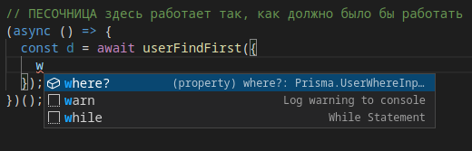
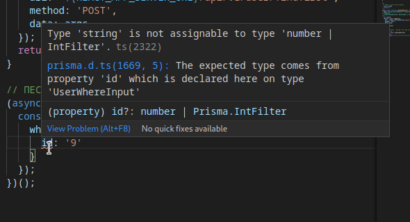
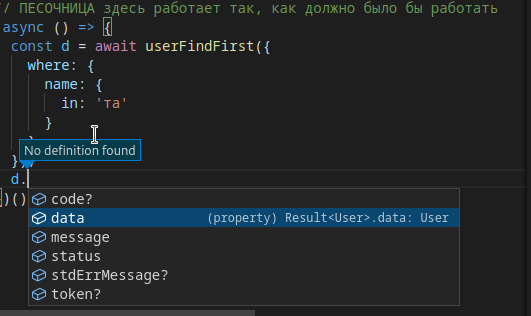
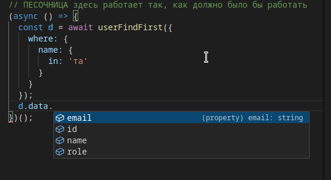
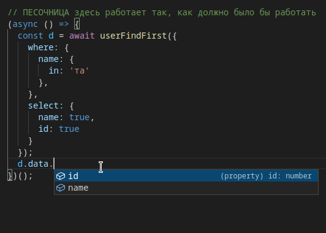

# React Javascript версия интерфейса для программирования запросов к серверу.

## Цель

Цель проложения продемонстрировать возможности связки по типам между фроонтендом и бекендом, для прямого доступа к автосгенерированным призмой типов данных базы и методов для
операций над ними.

## Динамические данные

Два файла `api/api.ts` и `api/prisma.d.ts` не являются постоянными, эти два файла будет поставлять разработчик бекенда, по мере добавления и изменения бекенда. Будет доступ к коду бекенда, и там в папке `api` будут эти файлы, разработчику фронтенда нужно будет только позаботится, чтобы эти **файлы из бекенда в его проект поступали и были в актуальном состоянии**.

## Различия реализации

Внимание! Данный проект рассчитан на внедрение в существующий javascript проект, поэтому есть небольшие ньансы:

- В обычном проекте файл `api/api.ts` был бы файлом `api/api.js` .

Поэтому разработчику фронтенда, чтобы продолжать использовать `.js` придется при добавлении новых методов, руками их добавлять. (Если на бекенде произойдут изменения не связанные с добавлением или удалением методов, то уже внутри них ничего менять не нужно). Однако, учитывая, что в js придется каждый раз использовать `api/api.ts` в качестве песочницы, вместо того чтобы IDE напрямую видел бы результат. Но даже несмотря на `js` такое апи всё равно достаточно удобное для фронтенда, так как сразу поставляет готовые методы и содержит песочницу, но чтобы испытать на 100% - **рекомендуется, пока не поздно переходить на typescript!**.

## Изменения по файлам в отличие от дефолтного React приложения 

# Установка

Клонировать проект

```
git clone https://github.com/kolserdav/api-prisma.git
```

Перейти в директорию

```
cd api-prisma
```

Установить зависимости

```
yarn install
```

Запуск

```
yarn start
```

_В браузере откроется окно_

## Примеры пользования песочницей

- Параметр `where` для выборки результата:
  
- Проверка на типы в передаваемых аргументах
  
- Результат полученный от сервера:
  
- Тип требуемой модели:
  
- Результат требуемой модели высчитывается с учетом анализа переданных аргументов, в данном случае пример с параметром `select`:
  
